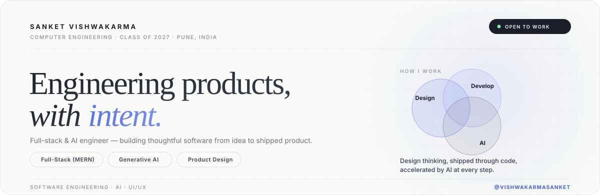
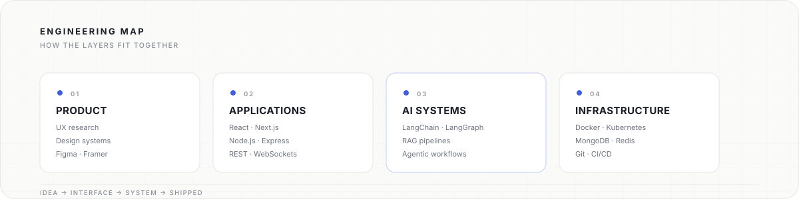

<p align="center">
  
</p>

<p align="center">
  <a href="https://sanket-vishwakarma-portfolio.vercel.app/">Portfolio</a>
  &nbsp;·&nbsp;
  <a href="https://www.linkedin.com/in/sanket-vishwakarma-361224338/">LinkedIn</a>
  &nbsp;·&nbsp;
  <a href="mailto:sanketvkarma10.work@gmail.com">Email</a>
  &nbsp;·&nbsp;
  <a href="https://github.com/VishwakarmaSanket">GitHub</a>
</p>

<br />

## / about

I'm a **Computer Engineering student** working at the intersection of **software engineering, generative AI, and product design**.

My default approach to a problem: **context → system → interface → implementation** — understand what's actually being solved before touching a single component, then build it in a way that's still easy to change six months later.

> **Consistency · Curiosity · Discipline**

<br />

## / now

<table>
<tr>
<td width="33%" valign="top">

**01 / BUILDING**

TypeScript-first web products, backend services, and AI-powered workflows — end to end.

</td>
<td width="33%" valign="top">

**02 / EXPLORING**

LLM orchestration, RAG pipelines, agentic systems, system design, and distributed infrastructure.

</td>
<td width="33%" valign="top">

**03 / DESIGNING**

Minimal interfaces and reusable systems, where UX decisions and engineering constraints reinforce each other instead of fighting.

</td>
</tr>
</table>

<br />

## / stack

```text
LANGUAGES       JavaScript · TypeScript · C++ · Python
FRONTEND        React · Next.js · Tailwind CSS · Redux Toolkit · GSAP · Framer Motion
BACKEND         Node.js · Express.js · REST APIs · WebSockets · JWT
GENAI           LangChain · LangGraph · RAG · LLM Applications
DATA            MongoDB · MySQL · Redis
INFRASTRUCTURE  Docker · Kubernetes · Git · GitHub · Render
DESIGN          Figma · Framer
```

<br />

<p align="center">
  
</p>

<br />

## / how I work

<table>
<tr>
<td width="25%" align="center"><code>01</code><br/><b>UNDERSTAND</b><br/><sub>problem before solution</sub></td>
<td width="25%" align="center"><code>02</code><br/><b>STRUCTURE</b><br/><sub>system before surface</sub></td>
<td width="25%" align="center"><code>03</code><br/><b>BUILD</b><br/><sub>simple before clever</sub></td>
<td width="25%" align="center"><code>04</code><br/><b>ITERATE</b><br/><sub>feedback before polish</sub></td>
</tr>
</table>

<br />

## / education

**Bachelor of Engineering — Computer Engineering**
Ajeenkya DY Patil School of Engineering · Savitribai Phule Pune University
`2023 — 2027` · `9.68 CGPA`

<br />

## / outside the editor

Gaming, exploring new tools, design rabbit holes, good food, and long YouTube rabbit holes.

<br />

<p align="center">
  <sub>Building, learning, and shipping.</sub><br/>
  <a href="https://github.com/VishwakarmaSanket">github.com/VishwakarmaSanket</a>
</p>
