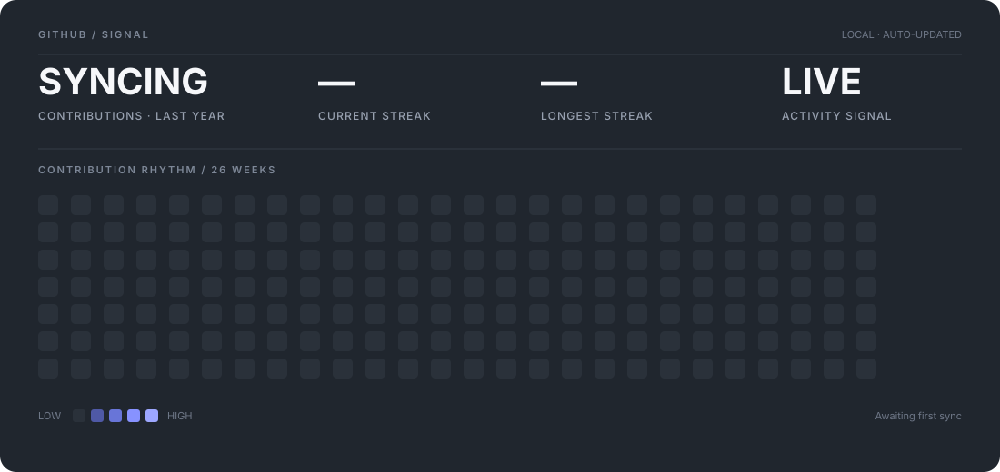

<p align="center">
  
</p>

<p align="center">
  <a href="https://sanket-vishwakarma-portfolio.vercel.app/">Portfolio</a>
  &nbsp;·&nbsp;
  <a href="https://www.linkedin.com/in/sanket-vishwakarma-361224338/">LinkedIn</a>
  &nbsp;·&nbsp;
  <a href="mailto:sanketvkarma10.work@gmail.com">Email</a>
  &nbsp;·&nbsp;
  <a href="https://github.com/VishwakarmaSanket">GitHub</a>
</p>

<br />

## / about

I’m a **Computer Engineering student** interested in the space where **software engineering, generative AI, and product design** meet.

I like taking a problem from **context → system → interface → implementation** and keeping the result understandable enough to evolve.

> **Consistency · Curiosity · Discipline**

<br />

## / now

<table>
<tr>
<td width="33%" valign="top">

**01 / BUILDING**

TypeScript-first web products, backend services, and AI-powered workflows.

</td>
<td width="33%" valign="top">

**02 / EXPLORING**

LLM orchestration, RAG, agentic systems, system design, and distributed infrastructure.

</td>
<td width="33%" valign="top">

**03 / DESIGNING**

Minimal interfaces, reusable systems, and product experiences where UX and engineering reinforce each other.

</td>
</tr>
</table>

<br />

## / stack

```text
LANGUAGES       JavaScript · TypeScript · C++ · Python
FRONTEND        React · Next.js · Tailwind CSS · Redux Toolkit · GSAP · Framer Motion
BACKEND         Node.js · Express.js · REST APIs · WebSockets · JWT
GENAI           LangChain · LangGraph · RAG · LLM Applications
DATA            MongoDB · MySQL · Redis
INFRASTRUCTURE  Docker · Kubernetes · Git · GitHub · Render
DESIGN          Figma · Framer
```

<br />

## / github signal

<p align="center">
  
</p>

<br />

## / working log

```text
09:42  BUILD   ↳ turning ideas into interfaces
11:18  STUDY   ↳ reading the system, not just the syntax
14:06  EXPLORE ↳ testing another model, another approach
18:31  SHIP    ↳ small commits > unfinished ambition
```

<sub>an intentionally small snapshot of how I like to work.</sub>

<br />

## / education

**Bachelor of Engineering — Computer Engineering**  
Ajeenkya DY Patil School of Engineering · Savitribai Phule Pune University  
`2023 — 2027` · `9.68 CGPA`

<br />

## / principles

| `01` | `02` | `03` |
|:---:|:---:|:---:|
| **UNDERSTAND**<br/>before building | **SIMPLIFY**<br/>over decorating | **SHIP**<br/>learn · iterate |

<br />

<p align="center">
  <sub>Building, learning, and shipping.</sub><br/>
  <a href="https://github.com/VishwakarmaSanket">github.com/VishwakarmaSanket</a>
</p>
