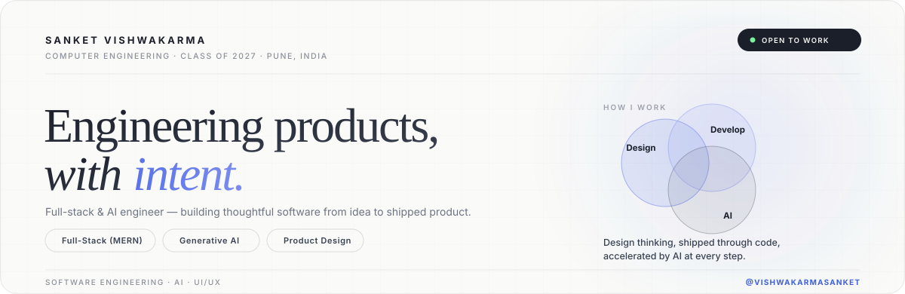

<p align="center">
  
</p>

<p align="center">
  <a href="https://sanket-vishwakarma-portfolio.vercel.app/">Portfolio</a>
  &nbsp;·&nbsp;
  <a href="https://www.linkedin.com/in/sanket-vishwakarma/">LinkedIn</a>
  &nbsp;·&nbsp;
  <a href="mailto:sanketvkarma10.work@gmail.com">Email</a>
</p>

---

## About

I'm a Computer Engineering student focused on **full-stack development, AI applications, backend systems, and product design**.

I like working end-to-end — understanding the problem, shaping the experience, designing the system, and then building it.

My current direction is toward **software engineering with a strong interest in AI-powered products and developer tools**.

---

## Currently

**Building**  
[Loveable](https://github.com/VishwakarmaSanket/Lovable-Project) — an AI-powered developer environment with isolated sandboxes, AI orchestration, and Kubernetes-based infrastructure.

**Learning**  
Data Structures & Algorithms, system design, databases, computer networks, operating systems, and distributed systems.

**Exploring**  
LLM applications, RAG, agentic workflows, AI evaluation, backend architecture, and infrastructure.

**Designing**  
Product experiences in Figma, with a focus on user flows, interaction design, simplicity, and reusable systems.

---

## Selected Work

### [Loveable — AI Developer Environment](https://github.com/VishwakarmaSanket/Lovable-Project)

An evolving developer environment built around isolated code sandboxes, AI orchestration, authentication, notifications, and Kubernetes infrastructure.

**TypeScript · Node.js · React · Kubernetes · Docker · AI**

> Active project — being developed and documented incrementally.

### [Customer Support AI Agent](https://github.com/VishwakarmaSanket/customer-support-ai-agent)

A support workflow that combines intent classification, semantic retrieval, grounded response generation, and human escalation. Built with an emphasis on knowing when the system has enough evidence to answer safely.

**Python · RAG · Embeddings · LLMs · Semantic Search**

### [AI Battle Arena](https://github.com/VishwakarmaSanket/AI-Battle-Arena)

A multi-model LLM evaluation experiment using a LangGraph workflow to run model responses in parallel and evaluate them through a separate judge model.

**TypeScript · LangChain · LangGraph · Gemini · Mistral · Cohere**

---

## Design Work

Selected UX/product work covering **Finnovo, Nudge, and Taj** — from problem framing and research to interaction design and high-fidelity prototypes.

**[View design work →](https://sanket-vishwakarma-portfolio.vercel.app/)**

---

## Core Stack

```text
LANGUAGES       JavaScript · TypeScript · Python · C++
FRONTEND        React · Next.js · Tailwind CSS · Redux Toolkit
BACKEND         Node.js · Express.js · REST APIs · WebSockets
AI              LangChain · LangGraph · RAG · LLM Applications
DATA            PostgreSQL · MongoDB · MySQL · Redis
INFRASTRUCTURE  Docker · Kubernetes · Git · GitHub
DESIGN          Figma
```

---

## Education

**B.E. — Computer Engineering**  
Ajeenkya DY Patil School of Engineering · Savitribai Phule Pune University  
`2023 — 2027`

---

## How I Work

**Understand → Structure → Build → Iterate**

I prefer solving the problem before optimizing the implementation, keeping systems understandable, and improving through feedback rather than adding complexity for its own sake.

---

## Outside the Editor

Gaming, exploring new tools, design rabbit holes, good food, and long YouTube rabbit holes.

---

<p align="center">
  <sub>Building, learning, and shipping.</sub><br/>
  <a href="https://github.com/VishwakarmaSanket">github.com/VishwakarmaSanket</a>
</p>
